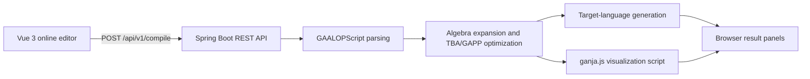

# GAALOP Forge: Geometric Algebra Compilation and Intelligent Computing

**English** | [简体中文](./README.zh-CN.md)

**GAALOP Forge** is a platform for compiling, optimizing, generating, and
visualizing geometric algebra programs. It extends
[GAALOP (Geometric Algebra Algorithms Optimizer)](https://github.com/CallForSanity/Gaalop)
with a Spring Boot REST service and a Vue 3 online workbench.

Developers can describe geometric algebra algorithms in GAALOPScript, select an
algebra space, optimization strategy, and target language, and receive generated
code together with an interactive ganja.js visualization. The platform supports
rapid geometric-computing prototypes, education, cross-language code generation,
computer graphics, robotics, and engineering applications.

> The primary usable interface is currently **Online Editing**. History, Help,
> and GA-CodeAgent are reserved for future development.

## User Interface


A typical workflow is:

1. Select the algebra space, code generator, optimization, and output mode.
2. Write GAALOPScript in **Code to Optimize**.
3. Enter optional visualization values and multivectors.
4. Select **Run** to inspect generated code and the ganja.js preview.

## How It Works



Key capabilities:

- Supports CGA, PGA, STA, DCGA, and other algebra spaces.
- Generates Java, C/C++, C#, Python, Rust, Julia, MATLAB, LaTeX, and Verilog.
- Exposes the public integration endpoint `POST /api/v1/compile`.
- Provides common subexpression elimination (CSE) and optional Maxima
  symbolic optimization.
- Returns target code and visualization scripts separately.
- Provides English, Chinese, and German OpenAPI documentation.

## Quick Start With Docker

The Docker image contains the frontend, backend, Nginx, JRE 17, and Maxima.
Install Docker Desktop or another Docker environment with Compose support.

Pull and run the Docker Hub image:

```bash
docker pull gagislab/gaalop-forge:1.0.0
docker run -d --name gaalop-forge -p 18080:8080 \
  -e GAALOP_SWAGGER_USERNAME=admin \
  -e GAALOP_SWAGGER_PASSWORD=change-me \
  gagislab/gaalop-forge:1.0.0
```

To build from source:

```bash
git clone https://github.com/GAGIS-Lab/gaalop-forge.git
cd gaalop-forge
cp .env.example .env
# Edit .env and set the Swagger username and password.
docker compose up -d --build
```

Open the services after startup:

| Service | URL |
|---|---|
| Online editor | <http://localhost:18080/> |
| Swagger UI | <http://localhost:18080/swagger-ui.html> |
| Health check | <http://localhost:18080/api/v1/health> |

Swagger uses HTTP Basic authentication. The local defaults are `GACRAC` and
`GAGIS`. Before public deployment, set `GAALOP_SWAGGER_USERNAME` and
`GAALOP_SWAGGER_PASSWORD` through the shell or a Git-ignored `.env` file. See
[`.env.example`](./.env.example).

```bash
docker compose ps
docker logs -f gaalop-forge
docker compose down
```

## Local Development

| Tool | Recommended version | Purpose |
|---|---:|---|
| JDK | 17 | Build and run Spring Boot |
| Maven | 3.9+ | Build the Java multi-module project |
| Node.js | 22 LTS | Run frontend tooling |
| pnpm | 10.25.0 | Manage frontend dependencies and scripts |
| Maxima | Optional | Required only for Maxima optimization |

### Start the Backend

Run from the repository root:

```bash
mvn -pl gaalop-rest -am -DskipTests package
java -jar gaalop-rest/target/gaalop-rest-1.0.0.jar
```

The backend listens on <http://localhost:8080>. To use a local Maxima
installation, specify its executable:

```bash
java -jar gaalop-rest/target/gaalop-rest-1.0.0.jar \
  --gaalop.maxima.command=/path/to/maxima
```

### Start the Frontend

```bash
cd frontend
pnpm install
pnpm dev
```

Vite proxies `/api` to `http://localhost:8080` by default. Override the target
when the backend is hosted elsewhere:

```powershell
$env:VITE_API_TARGET="http://localhost:8080"
pnpm dev
```

```bash
VITE_API_TARGET=http://localhost:8080 pnpm dev
```

Open <http://localhost:5173/>. Create a production build with `pnpm build`;
the output is written to `frontend/dist/`.

## Enable CSE and Maxima Optimization

The optimization controls apply to GAALOP's TBA (Table-Based Approach)
pipeline. Maxima is the computer algebra system used for symbolic
simplification.

### Configure in the Interface

Use the **Optimization** selector:

| Interface option | CSE | Maxima | Behavior |
|---|:---:|:---:|---|
| `Table-Based Approach` | Off | Off | Basic TBA optimization |
| `Table-Based + CSE` | On | Off | Eliminates repeated subexpressions |
| `Table-Based + Maxima` | Off | On | Applies symbolic simplification |
| `Table-Based + CSE + Maxima` | On | On | Enables both optimizations |

CSE needs no external program. Maxima is already installed and configured in
the Docker image.

### Configure Local Maxima

Install Maxima and place it on `PATH`, or pass its executable when starting the
backend:

```bash
java -jar gaalop-rest/target/gaalop-rest-1.0.0.jar \
  --gaalop.maxima.command=/path/to/maxima
```

Windows example:

```powershell
java -jar gaalop-rest/target/gaalop-rest-1.0.0.jar `
  --gaalop.maxima.command="C:\Program Files\Maxima\bin\maxima.bat"
```

The same value can be set in
`gaalop-rest/src/main/resources/application.properties` before rebuilding:

```properties
gaalop.maxima.command=tools/maxima/bin/maxima.bat
```

Relative paths are resolved from the backend working directory. Leave this
setting empty when Maxima optimization is not used.

### Configure Through the REST API

Control the optimizations independently:

```json
"optimization": {
  "cse": true,
  "maxima": true
}
```

Set only `cse` for CSE, only `maxima` for symbolic optimization, or set both to
`false` for basic TBA optimization.

## REST API Example

```http
POST /api/v1/compile
Content-Type: application/json
```

```json
{
  "algebraPlugins": "ALGEBRA_CGA",
  "codegenPlugins": "JAVA",
  "outputMode": "CODE_AND_VISUALIZATION",
  "optimization": {
    "cse": false,
    "maxima": false
  },
  "script": {
    "functionName": "sphereDemo",
    "optimizeCode": "?x=createPoint(a1,a2,a3);\n?S=x-0.5*(r*r)*einf;",
    "variableAssignments": "a1=0; a2=0; a3=0; r=0.5;",
    "multivectorsVisualized": ":Blue;\n:S;"
  }
}
```

`optimizeResult` contains the generated source code and `visualizationCode`
contains the ganja.js core script. Swagger UI documents all fields and values.

### Common Values

| Category | Values |
|---|---|
| Algebra spaces | `ALGEBRA_2D`, `ALGEBRA_3D`, `ALGEBRA_2D_PGA`, `ALGEBRA_3D_PGA`, `ALGEBRA_CRA`, `ALGEBRA_STA`, `ALGEBRA_CGA`, `ALGEBRA_GAC`, `ALGEBRA_DCGA`, `ALGEBRA_CCGA`, `ALGEBRA_QGA` |
| Output modes | `CODE_ONLY`, `CODE_AND_VISUALIZATION`, `VISUALIZATION_ONLY` |
| Code generators | `JAVA`, `CPP`, `CSHARP`, `PYTHON`, `RUST`, `JULIA`, `MATLAB`, `MATHEMATICA`, `LATEX`, `VERILOG`, `DOT`, `GANJA`, `GAPP`, and others |

## Project Structure

```text
frontend/                   Vue 3 + Vite online editor
gaalop-rest/                Spring Boot REST API and compile history
api/                        Compiler API and intermediate representation
clucalc/                    GAALOPScript parser
algebra/                    Built-in algebra definitions
tba/, gapp/                 Optimization pipelines
codegen-*/                  Target-language generators
visualCodeInserter/         Traditional visualization insertion
ganjaVisualCodeInserter/    ganja.js visualization insertion
testbenchTbaGapp/           Cross-module compiler tests
docker/                     Nginx and container startup scripts
docs/gaalopscript-analysis/ In-depth GAALOPScript documentation
```

Additional documentation:

- [GAALOPScript syntax rules](./GAALOPScript_Rules.md)
- [GAALOPScript analysis overview](./docs/gaalopscript-analysis/00-分析总览.md)
- [Project architecture](./docs/gaalopscript-analysis/01-项目架构.md)
- [Complete language reference](./docs/gaalopscript-analysis/02-完整语言参考.md)
- [Contributor guide](./AGENTS.md)

## Testing and Troubleshooting

```bash
mvn clean test
mvn -pl gaalop-rest -am test
cd frontend && pnpm build
```

- **Frontend reaches the wrong service:** check `VITE_API_TARGET` and restart Vite.
- **Maxima optimization fails:** verify `gaalop.maxima.command`.
- **Port conflict:** local backend and frontend ports are `8080` and `5173`;
  Docker exposes the application on `18080`.
- **First Maven build is slow:** the multi-module build downloads many compiler
  and code-generation dependencies.

Compile history is disabled by default because it contains submitted scripts
and generated results. Enable it with
`GAALOP_COMPILE_HISTORY_ENABLED=true` and define access and retention policies
for production deployments.

## Acknowledgments

This work was completed by **Wang Jian** at the Nanjing **Geometric Algebra Computing Research and Application Center**, under the guidance of **Yu Zhaoyuan**, **Luo Wen**, and **Dietmar Hildenbrand**.

## License

This project extends the original GAALOP project and is primarily distributed
under LGPL 3.0. The repository also contains components with separate licenses.
Review `LICENSE`, `LICENSE_ganjajs`, `LICENSE_iamath`, and `NOTICE.md` before
redistribution or modification.
