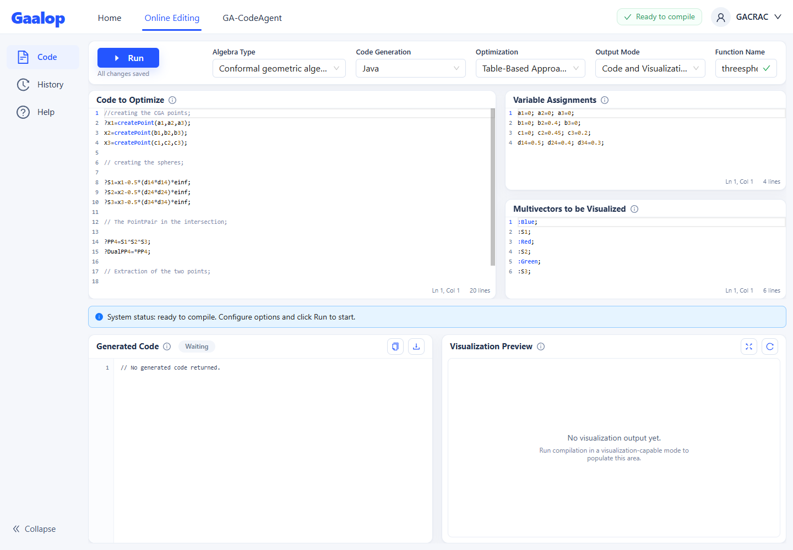
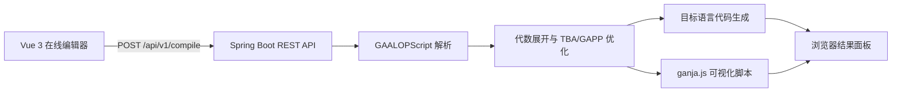

# GAALOP Forge：几何代数编译与智能计算平台

[English](./README.md) | **简体中文**

**GAALOP Forge** 是面向几何代数工程化应用的编译、优化、代码生成与可视化平台。“Forge” 表达将 GAALOPScript 和几何代数模型经过解析、优化与编译，锻造成可执行代码和可交互结果的完整过程。

平台建立在 [GAALOP（Geometric Algebra Algorithms Optimizer）](https://github.com/CallForSanity/Gaalop) 编译器基础之上，将原有解析器、优化器和代码生成插件封装为 Spring Boot REST 服务，并通过 Vue 3、Ant Design Vue 与 Monaco Editor 提供在线工作台。它不是简单的 GAALOPWeb 界面，而是可继续扩展命令行工具、编译服务和几何代数智能体工作流的一体化平台。

开发者可以使用较接近数学表达式的 **GAALOPScript** 描述几何代数算法，选择代数空间、优化策略和目标语言，然后直接获得生成代码与 ganja.js 可视化结果。项目适合几何计算原型验证、算法教学、跨语言代码生成，以及计算机图形学、机器人学和工程计算等场景。

> 本仓库当前的主要可用界面是 **Online Editing**。导航中的 History、Help 和 GA-CodeAgent 为后续功能入口。

## 系统界面



界面从上到下包含编译参数、三块脚本输入区、运行状态、目标代码和可视化预览。一次典型操作是：

1. 选择几何代数空间、代码生成器和优化方式。
2. 在 **Code to Optimize** 中编写 GAALOPScript。
3. 按需填写可视化变量值和待展示的多向量。
4. 点击 **Run**，同时查看生成代码和 ganja.js 预览。

## 它如何工作



主要能力：

- 支持 CGA、PGA、STA、DCGA 等多种几何代数空间。
- 生成 Java、C/C++、C#、Python、Rust、Julia、MATLAB、LaTeX、Verilog 等代码。
- 提供公共编译接口 `POST /api/v1/compile`，便于其他系统集成。
- 支持公共子表达式消除（CSE）和可选的 Maxima 符号优化。
- 将目标代码与可视化脚本分开返回，由前端组装 ganja.js 预览。
- 提供中、英、德三组 OpenAPI 文档及成功编译历史记录。

## 快速开始：Docker

Docker 方式已经包含前端、后端、Nginx、JRE 17 和 Maxima，是最省事的体验方式。请先安装 Docker Desktop 或其他支持 Compose 的 Docker 环境。

从 Docker Hub 拉取已发布镜像：

```bash
docker pull gagislab/gaalop-forge:1.1.0
docker run -d --name gaalop-forge -p 18080:8080 \
  -e GAALOP_SWAGGER_USERNAME=admin \
  -e GAALOP_SWAGGER_PASSWORD=change-me \
  gagislab/gaalop-forge:1.1.0
```

也可以从源码构建：

```bash
git clone https://github.com/GAGIS-Lab/gaalop-forge.git
cd gaalop-forge
cp .env.example .env
# 编辑 .env，设置 GAALOP_SWAGGER_USERNAME 和 GAALOP_SWAGGER_PASSWORD
docker compose up -d --build
```

启动后访问：

| 服务 | 地址 |
|---|---|
| 在线编辑器 | <http://localhost:18080/> |
| Swagger UI | <http://localhost:18080/swagger-ui.html> |
| 健康检查 | <http://localhost:18080/api/v1/health> |

Swagger 当前使用 HTTP Basic 认证，默认用户名为 `GACRAC`，密码为 `GAGIS`。公开部署前请设置 `GAALOP_SWAGGER_USERNAME` 和 `GAALOP_SWAGGER_PASSWORD`；Compose 会从当前 shell 或不会提交到 Git 的 `.env` 文件读取这两个变量。可参考 [`.env.example`](.env.example)。

```bash
docker compose ps                         # 查看状态
docker logs -f gaalop-forge               # 跟踪日志
docker compose down                       # 停止并移除容器
```

## 本地开发环境

| 工具 | 建议版本 | 用途 |
|---|---:|---|
| JDK | 17 | 构建并运行 Spring Boot；旧模块仍生成 Java 8 字节码 |
| Maven | 3.9+ | Java 多模块构建 |
| Node.js | 22 LTS | 前端运行时 |
| pnpm | 10.25.0 | 前端依赖和脚本管理 |
| Maxima | 可选 | 仅在启用 Maxima 优化时需要 |

### 1. 启动后端

在仓库根目录执行：

```bash
mvn -pl gaalop-rest -am -DskipTests package
java -jar gaalop-rest/target/gaalop-rest-1.0.0.jar
```

后端默认监听 <http://localhost:8080>。启用本机 Maxima 时，可显式指定可执行文件：

```bash
java -jar gaalop-rest/target/gaalop-rest-1.0.0.jar \
  --gaalop.maxima.command=/path/to/maxima
```

### 2. 启动前端

前端依赖统一由 pnpm 管理：

```bash
cd frontend
pnpm install
```

Vite 默认将 `/api` 代理到本机后端 `http://localhost:8080`。连接其他后端时可以覆盖代理目标。

PowerShell：

```powershell
$env:VITE_API_TARGET="http://localhost:8080"
pnpm dev
```

Bash：

```bash
VITE_API_TARGET=http://localhost:8080 pnpm dev
```

打开 <http://localhost:5173/>。生产构建使用：

```bash
pnpm build
```

构建产物位于 `frontend/dist/`。

## 开启 CSE 与 Maxima 优化

系统中的优化项作用于 GAALOP 的 TBA（Table-Based Approach）优化流程。这里的 **Maxima** 是计算机代数系统；如果你所说的 “mixmax” 指的是符号化简功能，对应的就是 Maxima 优化。

### 在界面中配置

在页面顶部的 **Optimization** 下拉框选择：

| 界面选项 | CSE | Maxima | 说明 |
|---|:---:|:---:|---|
| `Table-Based Approach` | 关闭 | 关闭 | 只运行基础 TBA 优化 |
| `Table-Based + CSE` | 开启 | 关闭 | 消除重复的公共子表达式 |
| `Table-Based + Maxima` | 关闭 | 开启 | 使用 Maxima 进行代数化简 |
| `Table-Based + CSE + Maxima` | 开启 | 开启 | 同时启用两种优化 |

CSE 不依赖外部程序，选择后即可使用。Maxima 在 Docker 镜像中已经安装并配置，无需额外操作。

### 本地配置 Maxima

本地运行后端时，先安装 Maxima，并确保 `maxima` 位于系统 `PATH`，或者在启动参数中指定可执行文件：

```bash
java -jar gaalop-rest/target/gaalop-rest-1.0.0.jar \
  --gaalop.maxima.command=/path/to/maxima
```

Windows 示例：

```powershell
java -jar gaalop-rest/target/gaalop-rest-1.0.0.jar `
  --gaalop.maxima.command="C:\Program Files\Maxima\bin\maxima.bat"
```

也可以在 `gaalop-rest/src/main/resources/application.properties` 中持久配置，修改后重新执行 Maven 打包：

```properties
gaalop.maxima.command=tools/maxima/bin/maxima.bat
```

相对路径以启动后端时的工作目录为基准。未启用 Maxima 优化时，该配置可以留空。

### 通过 REST API 配置

`optimization.cse` 和 `optimization.maxima` 可以分别控制两种优化：

```json
"optimization": {
  "cse": true,
  "maxima": true
}
```

只开启 CSE 时设置为 `{"cse": true, "maxima": false}`；只开启 Maxima 时设置为 `{"cse": false, "maxima": true}`。两项省略或均为 `false` 时使用基础 TBA 优化。

## REST API 示例

```http
POST /api/v1/compile
Content-Type: application/json
```

```json
{
  "algebraPlugins": "ALGEBRA_CGA",
  "codegenPlugins": "JAVA",
  "outputMode": "CODE_AND_VISUALIZATION",
  "optimization": {
    "cse": false,
    "maxima": false
  },
  "script": {
    "functionName": "sphereDemo",
    "optimizeCode": "?x=createPoint(a1,a2,a3);\n?S=x-0.5*(r*r)*einf;",
    "variableAssignments": "a1=0; a2=0; a3=0; r=0.5;",
    "multivectorsVisualized": ":Blue;\n:S;"
  }
}
```

成功响应中的 `optimizeResult` 是目标语言源码，`visualizationCode` 是供前端渲染的 ganja.js 核心脚本。详细字段和可选值请直接查看 Swagger UI。

### 常用枚举

以下为共享后端 API 的枚举。传统 GaalopWeb 页面已移除 QGA、QCA 量子入口和 qubit 配置；相关核心与 API 能力保留，供后续独立 QuantumGaalopWeb 复用。独立量子前端目前尚未实现。

| 类别 | 可选值 |
|---|---|
| 代数空间 | `ALGEBRA_2D`、`ALGEBRA_3D`、`ALGEBRA_2D_PGA`、`ALGEBRA_3D_PGA`、`ALGEBRA_CRA`、`ALGEBRA_STA`、`ALGEBRA_CGA`、`ALGEBRA_GAC`、`ALGEBRA_DCGA`、`ALGEBRA_CCGA`、`ALGEBRA_QGA`、`ALGEBRA_QCA` |
| 输出模式 | `CODE_ONLY`、`CODE_AND_VISUALIZATION`、`VISUALIZATION_ONLY` |
| 代码生成器 | `JAVA`、`CPP`、`CSHARP`、`PYTHON`、`RUST`、`JULIA`、`MATLAB`、`MATHEMATICA`、`LATEX`、`VERILOG`、`DOT`、`GANJA`、`GAPP` 等 |

## 项目结构

```text
frontend/                   Vue 3 + Vite 在线编辑器
gaalop-rest/                Spring Boot REST 接口、配置与编译历史
api/                        编译器公共 API 与中间表示
clucalc/                    GAALOPScript 解析器
algebra/                    内置几何代数定义
tba/、gapp/                 优化流程
codegen-*/                  各目标语言代码生成插件
visualCodeInserter/         传统可视化代码插入
ganjaVisualCodeInserter/    ganja.js 可视化代码插入
testbenchTbaGapp/           跨模块编译测试
docker/                     Nginx 与容器启动脚本
docs/gaalopscript-analysis/ GAALOPScript 深入分析文档
```

更多资料：

- [GAALOPScript 语法规则](./GAALOPScript_Rules.md)
- [GAALOPScript 分析总览](./docs/gaalopscript-analysis/00-分析总览.md)
- [项目架构说明](./docs/gaalopscript-analysis/01-项目架构.md)
- [完整语言参考](./docs/gaalopscript-analysis/02-完整语言参考.md)
- [贡献者指南](./AGENTS.md)

## QRA 扩展与维护

QRA 加速库的生成器、桥接模板、必需的第三方头文件和许可证已整理在 `native/qra/`，默认构建不依赖外部资源目录。

- [加速库生成与维护指南](docs/qra-acceleration-maintenance.md)：生成流程、Windows/Linux 构建、Java 调用及 qubit 扩展。
- [QRA 后端说明](docs/qra-integration.md)与[量子网页说明](docs/quantum-qra-web.md)。
- [9 qubit 内存实测](docs/qra-9qubit-memory.md)与[原始 Grover 脚本测试](docs/qra-resource-script-tests.md)。

## 测试与排障

```bash
mvn clean test                         # 运行全部 Java 测试
mvn -pl gaalop-rest -am test           # 验证 REST 模块及其依赖
cd frontend && pnpm build              # 验证前端可生产构建
```

- **前端请求到了错误的服务**：确认 `VITE_API_TARGET` 指向当前后端，并在修改后重启 Vite。
- **Maxima 优化失败**：检查 `gaalop.maxima.command` 是否指向可执行文件；不使用该优化时无需安装 Maxima。
- **端口冲突**：本地后端和前端默认使用 `8080`、`5173`，Docker 对外使用 `18080`。
- **`Failure in @ExceptionHandler` / `No acceptable representation`**：缺失资源的请求可能只接受 HTML、CSS 或图片。REST 错误响应固定使用 `application/json`，保留原始 400/404/500 状态和错误结构；接口本身无法满足 `Accept` 时返回空响应体的 406。升级后端后若仍出现该日志，请记录请求 URL 和 `Accept` 请求头。
- **`Invalid character found in method name [0x160x030x01…]`**：HTTPS/TLS 请求到达了纯 HTTP 监听端口。本地直连应使用 `http://localhost:8080`，默认 Docker 部署使用 `http://localhost:18080`。如需 HTTPS，应在配置证书的反向代理上终止 TLS，再通过 HTTP 转发至应用；检查代理上游地址是否误写为 `https://`。此错误发生在 Tomcat 解析请求阶段，REST 异常处理器无法处理。仅凭该日志不能判断是浏览器访问、代理配置还是外部探测导致。
- **首次 Maven 构建较慢**：项目包含较多编译和代码生成模块，Maven 需要下载完整依赖。

编译历史默认关闭，因为记录中包含用户提交的脚本和生成结果。如需启用，设置环境变量 `GAALOP_COMPILE_HISTORY_ENABLED=true`；生产部署还应设置目录访问权限并制定清理策略。

## 致谢

本项工作在南京 **Geometric Algebra Computing Research and Application Center**，由 **Yu Zhaoyuan**、**罗文** 和 **Dietmar Hildenbrand** 指导，并由 **Wang Jian** 完成。

## 许可证

项目基于原 GAALOP 工程继续开发，主体遵循 LGPL 3.0；仓库还包含 ganja.js 等第三方组件的单独许可证。分发或修改前请同时查看根目录中的 `LICENSE`、`LICENSE_ganjajs`、`LICENSE_iamath` 和 `NOTICE.md`。
